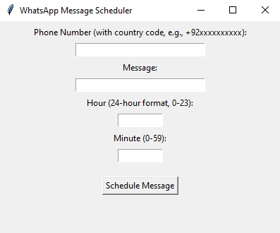

# 📲 WhatsApp Messages Automator

[](https://www.python.org/downloads/)
[](https://docs.python.org/3/library/tkinter.html)
[](https://pypi.org/project/pywhatkit/)
[](LICENSE)
[](#)

A simple and user-friendly Python desktop application to **schedule and instantly send WhatsApp messages**. Built using **Tkinter** for the interface and **pywhatkit** under the hood, this tool automates WhatsApp messaging right from your desktop with just a few clicks.

---

## 🚀 Features

- ✅ Easy-to-use GUI (no command-line needed)
- ✅ Schedule messages with time (hour and minute)
- ✅ Input validation for phone numbers and message content
- ✅ Uses your default browser & WhatsApp Web to send messages
- ✅ Instant message sending for quick testing

---

## 🛠️ Tech Stack

- **Python 3.7+**
- **Tkinter** – for the graphical user interface
- **PyWhatKit** – to interact with WhatsApp Web

---

## 📦 Installation

1. **Clone the repository**  
   ```bash
   git clone https://github.com/momina02/WhatsApp-Message-Automator.git
   cd automating-whatsapp-messages
   ```

2. **Install required packages**  
   ```bash
   pip install pywhatkit
   ```

---

## 🧠 How It Works

- Enter a phone number (with country code, e.g., `+92xxxxxxxxxx`)
- Type your message
- Enter the **hour** and **minute** (24-hour format)
- Click **"Schedule Message"**
- WhatsApp Web will open automatically and send the message at the scheduled time!

> 💡 Tip: For instant sending (for testing), the app uses `sendwhatmsg_instantly()` from pywhatkit.

---

## 📸 GUI Preview

<p align="center">
  
</p>

---

## 📄 License

This project is licensed under the [MIT License](LICENSE).

---

## 🙌 Contributing

Contributions, issues, and suggestions are welcome!  
Feel free to fork the repository and open a pull request.

---

Made with 💚 by a Python enthusiast automating everyday tasks.
